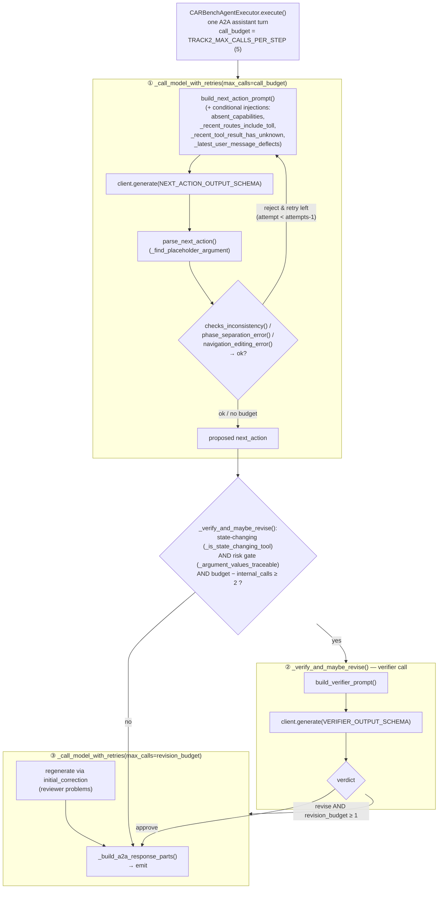

# Track 2 Agent — Sequential-Call Architecture (Audit)

**Constraint (README:185):** ≤ 5 sequential LLM calls per baseline LLM step;
parallel calls within a step allowed.

**Our compliance:** hard-capped by a shared per-step budget
(`TRACK2_MAX_CALLS_PER_STEP`, default 5). We use **0 parallel** calls — the
chain is strictly sequential and bounded. Malformed/enforcement retries are
counted as calls (conservative accounting). Guarantee: **≤ 5** in every step.

## Unit of accounting: what is one "baseline LLM step"

A **baseline LLM step = one action generation = one `execute()` call = one A2A
round** (the agent receives a message and returns exactly one action: either
tool calls or a user-facing response). The reference baseline makes **1** LLM
call per such step; our harness makes **≤ 5**, capped inside `execute()` whose
budget resets every A2A round. A per-step log line (`"Baseline step complete"`
with `sequential_llm_calls_this_step`) records the count for auditing.

> **Do not confuse this with `turn_metrics.num_llm_calls`.** That field is the
> **token-reporting** unit: `_record_turn_metrics()` (line 753) *accumulates*
> LLM calls across all A2A rounds of a whole conversational turn and flushes
> once at the final user-facing response. So `num_llm_calls` legitimately
> exceeds 5 for a multi-round turn (e.g. 3 tool rounds × ~4 calls = 12) — that
> is a sum over several baseline steps, **not** a per-step violation. The ≤ 5
> constraint applies per baseline step, which is guaranteed per `execute()`.

All names below refer to `src/track_2_agent_under_test_cerebras/car_bench_agent.py`.
The three stages are orchestrated sequentially in `CARBenchAgentExecutor.execute()`
— one invocation = one baseline LLM step.

## Worst-case sequential-call accounting

| Stage | Method | Max calls | Running total | Budget guard |
| --- | --- | --- | --- | --- |
| ① Executor (1 + up to `malformed_retries`=2) | `_call_model_with_retries(max_calls=5)` | 3 | 3 | `attempts = min(malformed_retries+1, max_calls)` |
| ② Verifier | `_verify_and_maybe_revise()` | 1 | 4 | runs only if `call_budget − internal_calls ≥ 2` |
| ③ Revision | `_call_model_with_retries(max_calls=revision_budget)` | 1 | **5** | `revision_budget = call_budget − internal_calls` |

**Maximum = 5.** Common case: executor 1 + verifier 1 + revision 1 = **3**.
Non-state-changing turns are returned by `_verify_and_maybe_revise()` before ②/③
(executor only, 1–3 calls).

Notes for auditors:
- The optional completeness pass (`_completeness_and_maybe_revise()`,
  `TRACK2_COMPLETENESS` **off** in the submitted config) shares the same budget
  (`call_budget − internal_calls ≥ 2` guard), so the ≤ 5 bound holds regardless
  of that toggle.
- No method depends on evaluator subscores or hidden task state; all reasoning
  in `build_next_action_prompt()`, `build_verifier_prompt()` and the enforcement
  functions uses only evaluator-provided inputs (conversation, tool results,
  tool definitions) and public domain knowledge (`tool_catalog.json`, policies).
- Token usage: ~105k / task average (limit 500k), reported via
  `_record_turn_metrics()` into `turn_metrics.prompt_tokens / completion_tokens /
  thinking_tokens`.
